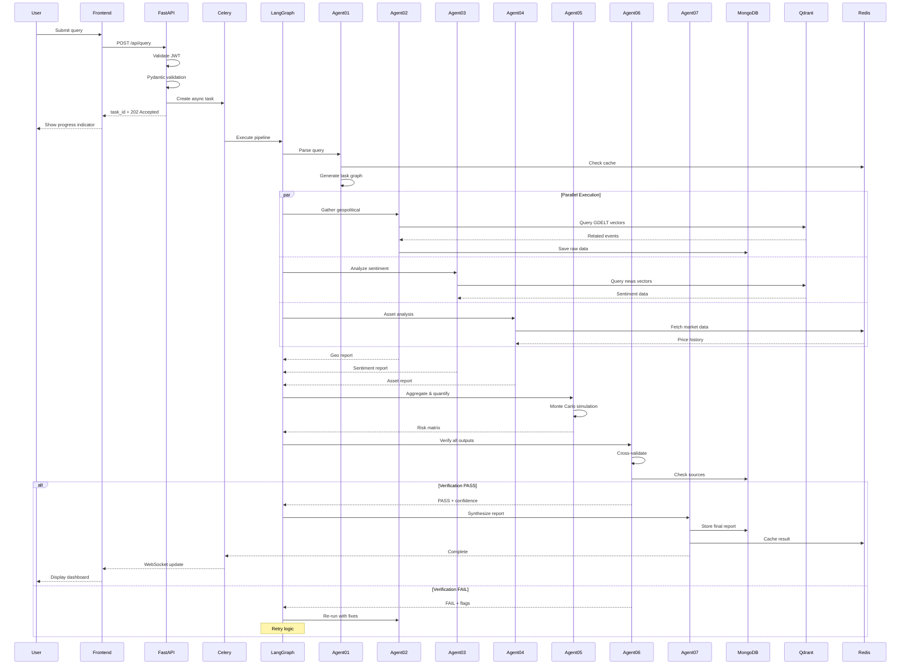

# SentinelAI — Project Planning & Implementation Roadmap

**Multi-Agent Geopolitical Market Intelligence Platform · Blue Team · Challenge 2026**

---

## 📋 Executive Summary

SentinelAI provides institutional-quality geopolitical and macroeconomic risk analysis for financial assets using 7 specialized AI agents. Production-grade platform combining Bloomberg Terminal intelligence with Multi-Agent AI orchestration.

**Target Assets:** Gold, Oil, S&P 500, Bitcoin, Ethereum

**Core Goals:**
- ✅ Zero infrastructure cost (free LLM tiers: Groq, OpenRouter, together.ai)
- ✅ Verifiable intelligence with full source attribution
- ✅ 7 specialized agents orchestrated via LangGraph
- ✅ 5 user roles with RBAC
- ✅ < 30s response time, < $0.01 per analysis

---

## 🏗️ System Architecture

### Layer 1 — Presentation
- **Frontend:** React 18 + Vite + Tailwind CSS (dark theme)
- **Visualization:** Recharts + D3.js (heatmaps, charts, macro timeline)
- **Auth:** Auth0 (OAuth2 + JWT, 5 role scopes)

### Layer 2 — API Gateway
- **Backend:** FastAPI (Python 3.12) with async endpoints
- **Queue:** Celery + Redis (async execution, retry logic)
- **Features:** Pydantic v2 validation, rate limiting, OpenAPI docs

### Layer 3 — 7 AI Agents (LangGraph)

| Agent | Model | Provider | Cost | Purpose |
|-------|-------|----------|------|----------|
| **01 🗺️ Routing** | Mistral 7B | Groq | Free | Parse query, manage pipeline state |
| **02 🌍 Geopolitical** | DeepSeek-V3 | OpenRouter | $0.07/M | GDELT events, FRED data, stability index |
| **03 📡 Sentiment** | Qwen2.5-72B | together.ai | Free | News clustering, retail vs institutional signals |
| **04 💹 Asset Analyst** | DeepSeek-R1 Distill | Groq | Free | Per-asset modeling (Gold, Oil, S&P, BTC, ETH) |
| **05 🧮 Quant & Risk** | DeepSeek-R1 Full | OpenRouter | $0.55/M | Monte Carlo, GARCH, scenario probabilities |
| **06 🛡️ Critic** | Llama 3.3 70B | Groq | Free | Quality gate — validates all outputs |
| **07 📦 Synthesis** | Mistral Small 3 | Groq | Free | Dashboard + PDF + reasoning trace |

### Layer 4 — Data & Persistence

- **MongoDB Atlas:** Users, sessions, query history, agent outputs, audits
- **Qdrant:** News embeddings, RAG corpus, semantic search
- **Redis:** Celery broker, session cache, rate limits, market data buffer
- **AWS S3:** PDF archives, dataset snapshots

---

## � System Architecture Diagram

```
┌─────────────────────────────────────────────────────────────────────────────────┐
│                          USER / CLIENT LAYER                                     │
├─────────────────────────────────────────────────────────────────────────────────┤
│  React Dashboard    │  Risk Analyst UI  │  Portfolio Mgr UI  │  Research UI     │
│  (Auth0 Protected)  │  (Role-Scoped)    │  (Role-Scoped)     │  (Role-Scoped)   │
└──────────────────────────────┬──────────────────────────────────────────────────┘
                               │ HTTPS/TLS 1.3
                               ▼
┌─────────────────────────────────────────────────────────────────────────────────┐
│                         API GATEWAY LAYER                                        │
├─────────────────────────────────────────────────────────────────────────────────┤
│  ┌──────────────────────────────────────────────────────────────────────────┐   │
│  │ FastAPI (Python 3.12)                                                    │   │
│  │ • Auth Middleware (JWT Validation)                                       │   │
│  │ • Rate Limiting (Redis-based)                                            │   │
│  │ • Pydantic v2 Validation                                                 │   │
│  │ • OpenAPI Documentation                                                  │   │
│  └──────────────────────────┬───────────────────────────────────────────────┘   │
└────────────────────────────┬┴───────────────────────────────────────────────────┘
                             │
         ┌───────────────────┴───────────────────┐
         ▼                                       ▼
┌──────────────────────┐              ┌──────────────────────┐
│   Celery Worker      │              │   Redis Queue        │
│   (Async Execution)  │◄─────────────┤   (Job Broker)       │
└──────────┬───────────┘              └──────────────────────┘
           │
           ▼
┌─────────────────────────────────────────────────────────────────────────────────┐
│                         LANGGRAPH ORCHESTRATION LAYER                            │
├─────────────────────────────────────────────────────────────────────────────────┤
│                                                                                   │
│   ┌────────────┐      ┌─────────────────────────────────────────────────┐      │
│   │  Agent 01  │─────►│          Intelligence Gathering                 │      │
│   │  Routing   │      │  (Parallel Execution)                           │      │
│   └────────────┘      │                                                 │      │
│         │             │  ┌──────────┐  ┌──────────┐  ┌──────────┐     │      │
│         ▼             │  │ Agent 02 │  │ Agent 03 │  │ Agent 04 │     │      │
│   Task Graph          │  │Geopolitical│  │Sentiment │  │  Asset  │     │      │
│   Generated           │  │   Macro  │  │ Analysis │  │ Analyst  │     │      │
│                       │  └──────────┘  └──────────┘  └──────────┘     │      │
│                       └─────────────────────┬───────────────────────────┘      │
│                                             ▼                                    │
│                                    ┌──────────────┐                             │
│                                    │   Agent 05   │                             │
│                                    │ Quant & Risk │                             │
│                                    │ Aggregation  │                             │
│                                    └───────┬──────┘                             │
│                                            ▼                                     │
│                                    ┌──────────────┐                             │
│                                    │   Agent 06   │◄─── QUALITY GATE            │
│                                    │    Critic    │     (Critical)              │
│                                    │ Verification │                             │
│                                    └───────┬──────┘                             │
│                                            │                                     │
│                                      ┌─────┴─────┐                              │
│                                      │   PASS?   │                              │
│                                      └─────┬─────┘                              │
│                                   YES │   │ NO                                  │
│                              ┌────────┘   └─────────┐                           │
│                              ▼                      ▼                           │
│                     ┌──────────────┐        ┌────────────┐                     │
│                     │   Agent 07   │        │  Re-run    │                     │
│                     │  Synthesis   │        │  Failed    │                     │
│                     │   & Report   │        │  Agents    │                     │
│                     └───────┬──────┘        └────────────┘                     │
│                             │                                                    │
└─────────────────────────────┼────────────────────────────────────────────────────┘
                              ▼
┌─────────────────────────────────────────────────────────────────────────────────┐
│                         DATA & PERSISTENCE LAYER                                 │
├─────────────────────────────────────────────────────────────────────────────────┤
│  ┌──────────────┐  ┌──────────────┐  ┌──────────────┐  ┌──────────────┐      │
│  │   MongoDB    │  │   Qdrant     │  │    Redis     │  │   AWS S3     │      │
│  │   Atlas      │  │  (Vectors)   │  │   (Cache)    │  │   (PDFs)     │      │
│  └──────┬───────┘  └──────┬───────┘  └──────┬───────┘  └──────┬───────┘      │
└─────────┼──────────────────┼──────────────────┼──────────────────┼──────────────┘
          │                  │                  │                  │
          ▼                  ▼                  ▼                  ▼
┌─────────────────────────────────────────────────────────────────────────────────┐
│                         EXTERNAL DATA SOURCES                                    │
├─────────────────────────────────────────────────────────────────────────────────┤
│  GDELT   │  FRED  │  Yahoo Finance  │  Alpha Vantage  │  Reddit  │  Twitter    │
│  Reuters │  IMF   │  World Bank     │  CBOE VIX       │  Options │  Fear&Greed │
└─────────────────────────────────────────────────────────────────────────────────┘

┌─────────────────────────────────────────────────────────────────────────────────┐
│                         OBSERVABILITY & SECURITY                                 │
├─────────────────────────────────────────────────────────────────────────────────┤
│  LangFuse (Traces)  │  Grafana (Metrics)  │  Vault (Secrets)  │  PromptFoo    │
└─────────────────────────────────────────────────────────────────────────────────┘
```

---

## 📊 Agent Pipeline Flow

```
┌─────────────────────────────────────────────────────────────────────────────────┐
│                         QUERY SUBMISSION & ROUTING                               │
└─────────────────────────────────────────────────────────────────────────────────┘

User Query: "Analyze geopolitical risks for Gold over the next 30 days"
     │
     ▼
┌─────────────────────────────────────────────────────────────────────────────────┐
│ AGENT 01: Intake & Routing (Mistral 7B via Groq)                                │
├─────────────────────────────────────────────────────────────────────────────────┤
│ Input:  Raw user query                                                           │
│ Process: • Parse query intent                                                    │
│          • Extract: asset_class="Gold", timeframe=30, risk_profile="moderate"   │
│          • Validate schema with Pydantic                                         │
│          • Generate task graph for downstream agents                             │
│ Output:  Structured task object → LangGraph state                               │
│ Time:    ~0.5 seconds                                                            │
└─────────────────────────────────────────────────────────────────────────────────┘
     │
     ▼
┌─────────────────────────────────────────────────────────────────────────────────┐
│              PARALLEL INTELLIGENCE GATHERING PHASE                               │
└─────────────────────────────────────────────────────────────────────────────────┘
     │
     ├──────────────────────────┬──────────────────────────┬───────────────────────┐
     ▼                          ▼                          ▼                       ▼
┏━━━━━━━━━━━━━━━━━━━━┓  ┏━━━━━━━━━━━━━━━━━━━━┓  ┏━━━━━━━━━━━━━━━━━━━━┓
┃ AGENT 02:          ┃  ┃ AGENT 03:          ┃  ┃ AGENT 04:          ┃
┃ Geopolitical       ┃  ┃ Market Sentiment   ┃  ┃ Asset Analyst      ┃
┃ (DeepSeek-V3)      ┃  ┃ (Qwen2.5-72B)      ┃  ┃ (DeepSeek-R1)      ┃
┣━━━━━━━━━━━━━━━━━━━━┫  ┣━━━━━━━━━━━━━━━━━━━━┫  ┣━━━━━━━━━━━━━━━━━━━━┫
┃ • Query GDELT      ┃  ┃ • Fetch news feeds ┃  ┃ • Gold-specific    ┃
┃ • Retrieve FRED    ┃  ┃ • Scan Reddit WSB  ┃  ┃   modeling         ┃
┃ • Geopolitical     ┃  ┃ • Twitter trending ┃  ┃ • Historical price ┃
┃   stability score  ┃  ┃ • Fear & Greed idx ┃  ┃   patterns         ┃
┃ • Event vectors    ┃  ┃ • Sentiment scores ┃  ┃ • Pressure scores  ┃
┃ Time: ~3-4 sec     ┃  ┃ Time: ~2-3 sec     ┃  ┃ Time: ~3-4 sec     ┃
┗━━━━━━━━━━━━━━━━━━━━┛  ┗━━━━━━━━━━━━━━━━━━━━┛  ┗━━━━━━━━━━━━━━━━━━━━┛
     │                          │                          │
     └──────────────────────────┴──────────────────────────┴───────────────────────┐
                                                                                     ▼
┌─────────────────────────────────────────────────────────────────────────────────┐
│ AGENT 05: Quant & Risk Aggregation (DeepSeek-R1 Full via OpenRouter)            │
├─────────────────────────────────────────────────────────────────────────────────┤
│ Input:  Outputs from Agents 02, 03, 04                                          │
│ Process: • Aggregate signals across agents                                       │
│          • Run Monte Carlo simulations (1000 iterations)                         │
│          • GARCH volatility modeling                                             │
│          • Correlation breakdown analysis                                        │
│          • Scenario probability calculation                                      │
│ Output:  Risk matrix with probability-weighted scenarios                        │
│ Time:    ~5-7 seconds                                                            │
└─────────────────────────────────────────────────────────────────────────────────┘
     │
     ▼
┌─────────────────────────────────────────────────────────────────────────────────┐
│ AGENT 06: Critic & Verification (Llama 3.3 70B via Groq) ⚠️ QUALITY GATE       │
├─────────────────────────────────────────────────────────────────────────────────┤
│ Input:  ALL outputs from Agents 02-05                                           │
│ Process: • Cross-validate internal consistency                                   │
│          • Verify source citations (100% requirement)                            │
│          • Flag low-confidence claims (<70%)                                     │
│          • Check for contradictions between agents                               │
│          • Calculate overall confidence score                                    │
│ Decision: PASS / FAIL / REVISE                                                  │
│ Output:  Verification report + flagged issues                                   │
│ Time:    ~3-4 seconds                                                            │
│                                                                                   │
│ IF FAIL → Re-run specific agent with targeted prompts                           │
│ IF PASS → Continue to synthesis                                                 │
└─────────────────────────────────────────────────────────────────────────────────┘
     │ (PASS)
     ▼
┌─────────────────────────────────────────────────────────────────────────────────┐
│ AGENT 07: Report Synthesis (Mistral Small 3 via Groq)                           │
├─────────────────────────────────────────────────────────────────────────────────┤
│ Input:  Verified outputs + verification report                                  │
│ Process: • Assemble dashboard JSON payload                                       │
│          • Generate risk heatmap data                                            │
│          • Create macro timeline events                                          │
│          • Format reasoning trace                                                │
│          • Trigger WeasyPrint for PDF generation                                 │
│ Output:  • Interactive dashboard                                                │
│          • Risk heatmap visualization                                            │
│          • Macro timeline (Gantt)                                                │
│          • PDF intelligence report                                               │
│          • Structured reasoning trace (JSON)                                     │
│ Time:    ~4-5 seconds                                                            │
└─────────────────────────────────────────────────────────────────────────────────┘
     │
     ▼
┌─────────────────────────────────────────────────────────────────────────────────┐
│                         RESPONSE TO USER                                         │
├─────────────────────────────────────────────────────────────────────────────────┤
│ Total Pipeline Time: ~20-30 seconds                                             │
│ Cost per Analysis: < $0.01                                                      │
│ Source Attribution: 100%                                                         │
│ Confidence Score: 87% (example)                                                  │
└─────────────────────────────────────────────────────────────────────────────────┘
```

---

## 🔄 Data Flow Architecture

```
┌─────────────────────────────────────────────────────────────────────────────────┐
│                         INGESTION & PREPROCESSING                                │
└─────────────────────────────────────────────────────────────────────────────────┘

[External APIs] ──► [Data Collectors] ──► [Validation] ──► [Storage]
                                                                │
    ┌────────────────────────┬──────────────────┬─────────────┘
    ▼                        ▼                  ▼
┌─────────┐          ┌──────────────┐    ┌─────────────────┐
│ MongoDB │          │   Qdrant     │    │  Redis Cache    │
│ (Raw)   │          │  (Vectors)   │    │  (Hot Data)     │
└────┬────┘          └──────┬───────┘    └────────┬────────┘
     │                      │                      │
     └──────────────────────┴──────────────────────┘
                            │
                            ▼
┌─────────────────────────────────────────────────────────────────────────────────┐
│                         RAG RETRIEVAL PIPELINE                                   │
├─────────────────────────────────────────────────────────────────────────────────┤
│                                                                                   │
│  Agent Query                                                                     │
│       │                                                                           │
│       ▼                                                                           │
│  ┌─────────────────────┐                                                        │
│  │ Embedding Generator │  (generates query embedding)                           │
│  └──────────┬──────────┘                                                        │
│             ▼                                                                     │
│  ┌─────────────────────┐                                                        │
│  │ Qdrant Search       │  (semantic similarity search)                          │
│  │ Top-K: 20 chunks    │                                                        │
│  └──────────┬──────────┘                                                        │
│             ▼                                                                     │
│  ┌─────────────────────┐                                                        │
│  │ Re-ranker           │  (confidence scoring)                                  │
│  │ Top-N: 10 chunks    │                                                        │
│  └──────────┬──────────┘                                                        │
│             ▼                                                                     │
│  ┌─────────────────────┐                                                        │
│  │ Source Attribution  │  (attach metadata: URL, date, confidence)             │
│  └──────────┬──────────┘                                                        │
│             ▼                                                                     │
│  Retrieved Context + Sources → Agent LLM                                        │
│                                                                                   │
└─────────────────────────────────────────────────────────────────────────────────┘
                            │
                            ▼
┌─────────────────────────────────────────────────────────────────────────────────┐
│                         AGENT PROCESSING                                         │
├─────────────────────────────────────────────────────────────────────────────────┤
│                                                                                   │
│  Context + Query ──► [LLM Inference] ──► Structured Output (Pydantic)          │
│                           │                                                       │
│                           ▼                                                       │
│                    [LangFuse Trace]                                              │
│                    • Token count                                                 │
│                    • Latency                                                     │
│                    • Cost                                                        │
│                    • Confidence                                                  │
│                                                                                   │
└─────────────────────────────────────────────────────────────────────────────────┘
                            │
                            ▼
┌─────────────────────────────────────────────────────────────────────────────────┐
│                         OUTPUT PERSISTENCE                                       │
├─────────────────────────────────────────────────────────────────────────────────┤
│                                                                                   │
│  Agent Output ──► MongoDB (store) ──► Audit Log                                │
│       │                                                                           │
│       ├───► Dashboard API                                                        │
│       ├───► PDF Generator ──► AWS S3                                            │
│       └───► WebSocket (real-time updates)                                       │
│                                                                                   │
└─────────────────────────────────────────────────────────────────────────────────┘
```

---

## 🌐 Request/Response Flow



---

## �🔐 Security Architecture

**6 Security Layers:**
1. **Input Sanitization:** Pydantic v2 validation, prompt injection prevention
2. **RAG Whitelisting:** Trusted sources only, no user documents
3. **Tool Restrictions:** Pre-approved functions only, audit trail
4. **Secrets Management:** HashiCorp Vault with rotation
5. **Encryption:** AES-256 at rest, TLS 1.3 in transit
6. **Adversarial Testing:** PromptFoo for red team evaluation

---

## 🤖 LLM Inference Strategy

**Key Principle:** Agents run sequentially (one at a time) → Zero GPU needed locally

### 3 Free Providers

1. **Groq** (Primary) — console.groq.com
   - 300+ tok/sec, 500K tokens/day free
   - `GROQ_API_KEY=gsk_xxxx`

2. **OpenRouter** (Deep Reasoning) — openrouter.ai
   - $5 free credits, 200+ models
   - `OPENROUTER_API_KEY=sk-or-xxxx`

3. **together.ai** (NLP) — together.ai
   - $25 free credits
   - `TOGETHER_API_KEY=xxxx`

### Cost: ~$1 for 100 pipeline runs

### LLM Configuration: `config/llm.py`

```python
import os
from dotenv import load_dotenv
from langchain_groq import ChatGroq
from langchain_openai import ChatOpenAI
from langchain_ollama import ChatOllama

load_dotenv()
MODE = os.getenv("INFERENCE_MODE", "production")

def get_llm(agent_id: str):
    if MODE == "local":
        return ChatOllama(model="mistral:7b-instruct")
    
    configs = {
        "agent_01": ("groq", "mistral-7b-instruct"),
        "agent_02": ("openrouter", "deepseek/deepseek-chat"),
        "agent_03": ("together", "Qwen/Qwen2.5-72B-Instruct-Turbo"),
        "agent_04": ("groq", "deepseek-r1-distill-llama-70b"),
        "agent_05": ("openrouter", "deepseek/deepseek-r1"),
        "agent_06": ("groq", "llama-3.3-70b-versatile"),
        "agent_07": ("groq", "mistral-small-3"),
    }
    
    provider, model = configs[agent_id]
    if provider == "groq":
        return ChatGroq(model=model, api_key=os.getenv("GROQ_API_KEY"))
    elif provider == "openrouter":
        return ChatOpenAI(base_url="https://openrouter.ai/api/v1", model=model, api_key=os.getenv("OPENROUTER_API_KEY"))
    elif provider == "together":
        return ChatOpenAI(base_url="https://api.together.xyz/v1", model=model, api_key=os.getenv("TOGETHER_API_KEY"))
```

### Fallback Strategy

```python
from tenacity import retry, wait_exponential, stop_after_attempt

@retry(wait=wait_exponential(min=2, max=30), stop=stop_after_attempt(3))
def safe_invoke(llm, prompt):
    return llm.invoke(prompt)
```

---

## 📊 Data Sources & APIs

- **Market Data:** Yahoo Finance, Alpha Vantage, CBOE VIX, FRED, Options flow
- **News & Events:** GDELT, Reuters RSS, Central Bank comms, Political event databases
- **Macro Data:** IMF, World Bank, ECB, Federal Reserve, BCT
- **Sentiment:** Reddit, Twitter/X, Fear & Greed Index, Dark pool indicators

---

## 🔭 Observability & DevOps

- **LangFuse:** LLM traces, token usage, latency per agent
- **Grafana:** System health, performance metrics, error rates
- **Logging:** Structured JSON logs with tracing IDs
- **Deployment:** Docker + AWS ECS, auto-scaling
- **CI/CD:** GitHub Actions (automated tests, Docker build)
- **Testing:** Pytest (unit/integration), RAGAS (RAG quality), PromptFoo (adversarial)

---

## 👥 User Roles & Access Control

| Role | Access |\n|------|--------|\n| **🏦 Institutional Investor** | Full access: scenarios, portfolio view, PDF reports, history |\n| **⚠️ Risk Analyst** | Heatmaps, stress tests, volatility analysis, tail risk |\n| **💼 Portfolio Manager** | Asset allocation, ROI scenarios, rebalancing signals |\n| **🔬 Research Analyst** | Raw signals, full citations, reasoning traces, data export |\n| **⚖️ Compliance Officer** | Audit logs, decision traces, source verification, user activity |

---

## 📦 Deliverables

**Per Analysis Output:**
1. **Interactive Dashboard:** Real-time risk scores, dynamic filtering, drill-down
2. **Risk Heatmap:** Color-coded severity, correlation matrix, time-series evolution
3. **Macro Timeline:** Gantt-style event sequencing, event-to-asset impact
4. **PDF Report:** Executive summary, asset analysis, geo context, full citations (WeasyPrint)
5. **Reasoning Trace (JSON):** Per-agent I/O, confidence scores, source attribution

---

## 🗓️ Implementation Roadmap (9 Weeks)

### Phase 1: Foundation (Weeks 1-2)
- Environment setup (API keys, MongoDB, Qdrant, Redis)
- FastAPI backend structure + `config/llm.py`
- Auth0 integration, Celery job queue
- Database schemas and RAG pipeline

### Phase 2: Agent Implementation (Weeks 3-4)
- Agent 02: Geopolitical & Macro (GDELT, FRED)
- Agent 03: Market Sentiment (news, social signals)
- Agent 04: Asset-Specific Analyst (5 asset pipelines)
- Agent 05: Quant & Risk (Monte Carlo, GARCH)

### Phase 3: Quality & Output (Weeks 5-6)
- Agent 06: Critic & Verification (quality gate)
- Agent 07: Report Synthesis (dashboard, PDF)
- React frontend (Vite + Tailwind)
- Visualization components (Recharts, D3.js)

### Phase 4: Security & Testing (Weeks 7-8)
- HashiCorp Vault, prompt injection prevention
- Auth0 RBAC, rate limiting
- Pytest, RAGAS evaluation, PromptFoo adversarial tests
- LangFuse + Grafana observability

### Phase 5: Deployment (Week 9)
- Docker + AWS ECS deployment
- GitHub Actions CI/CD
- Documentation and final testing
- Demo preparation

---

## 📚 Environment Variables

```bash
# .env — NEVER commit this file

# LLM Providers
GROQ_API_KEY=gsk_xxxx
OPENROUTER_API_KEY=sk-or-xxxx
TOGETHER_API_KEY=xxxx
INFERENCE_MODE=production

# Databases
MONGODB_URI=mongodb+srv://...
QDRANT_URL=https://xxxxx.cloud.qdrant.io
QDRANT_API_KEY=xxxx
REDIS_URL=redis://localhost:6379/0

# Auth
AUTH0_DOMAIN=your-tenant.us.auth0.com
AUTH0_CLIENT_ID=xxxx
AUTH0_CLIENT_SECRET=xxxx

# Data Sources
FRED_API_KEY=xxxx
ALPHA_VANTAGE_KEY=xxxx

# Secrets & Observability
VAULT_ADDR=http://localhost:8200
LANGFUSE_PUBLIC_KEY=pk-lf-xxxx
LANGFUSE_SECRET_KEY=sk-lf-xxxx

# AWS
AWS_ACCESS_KEY_ID=AKIAXXXX
AWS_SECRET_ACCESS_KEY=xxxx
S3_BUCKET_NAME=sentinelai-reports
```

---

## 🚀 Quick Start

```bash
# 1. Clone and setup
git clone https://github.com/your-org/SentinelAI.git
cd SentinelAI
python -m venv venv
source venv/bin/activate
pip install -r requirements.txt

# 2. Register for free API keys (10 min)
# Groq, OpenRouter, together.ai, MongoDB Atlas, Qdrant, FRED, Alpha Vantage

# 3. Configure .env
cp .env.example .env
# Edit .env with your API keys

# 4. Run services
redis-server &
celery -A app.celery_app worker --loglevel=info &
uvicorn app.main:app --reload --port 8000 &
cd frontend && npm run dev

# 5. Access at http://localhost:5173
```

---

## 🛠️ Technology Stack

**Frontend:** React 18, Vite, Tailwind CSS, Recharts, D3.js, Auth0 React SDK  
**Backend:** FastAPI, Celery, Redis, Pydantic v2  
**AI:** LangGraph, LangChain, langchain-groq, langchain-openai  
**Data Science:** NumPy, pandas, scipy, statsmodels, yfinance  
**Databases:** MongoDB Atlas, Qdrant, Redis  
**Security:** Auth0, HashiCorp Vault, PromptFoo  
**Observability:** LangFuse, Grafana  
**DevOps:** Docker, AWS ECS, GitHub Actions, Pytest, RAGAS

---

## 📖 Project File Structure

```
SentinelAI/
│
├── backend/
│   ├── app/
│   │   ├── main.py                 # FastAPI application entry point
│   │   ├── celery_app.py           # Celery configuration
│   │   ├── api/
│   │   │   ├── routes/
│   │   │   │   ├── auth.py         # Authentication routes
│   │   │   │   ├── query.py        # Query submission endpoints
│   │   │   │   ├── reports.py      # Report retrieval endpoints
│   │   │   │   └── admin.py        # Admin endpoints
│   │   │   └── middleware/
│   │   │       ├── auth.py         # JWT validation
│   │   │       ├── rate_limit.py   # Rate limiting
│   │   │       └── error_handler.py
│   │   ├── agents/
│   │   │   ├── agent_01_routing.py
│   │   │   ├── agent_02_geopolitical.py
│   │   │   ├── agent_03_sentiment.py
│   │   │   ├── agent_04_asset_analyst.py
│   │   │   ├── agent_05_quant_risk.py
│   │   │   ├── agent_06_critic.py
│   │   │   └── agent_07_synthesis.py
│   │   ├── orchestration/
│   │   │   ├── langgraph_pipeline.py  # Main LangGraph DAG
│   │   │   ├── state.py                # Pipeline state management
│   │   │   └── checkpoints.py          # Checkpoint logic
│   │   ├── config/
│   │   │   ├── llm.py              # LLM provider routing (CRITICAL FILE)
│   │   │   ├── settings.py         # Environment config
│   │   │   └── logging.py          # Logging setup
│   │   ├── data_sources/
│   │   │   ├── fred_client.py      # FRED API client
│   │   │   ├── gdelt_client.py     # GDELT news retrieval
│   │   │   ├── market_data.py      # Yahoo Finance, Alpha Vantage
│   │   │   └── social_sentiment.py # Reddit, Twitter collectors
│   │   ├── rag/
│   │   │   ├── embeddings.py       # Embedding generation
│   │   │   ├── retrieval.py        # Qdrant semantic search
│   │   │   ├── chunking.py         # Document chunking
│   │   │   └── attribution.py      # Source tracking
│   │   ├── models/
│   │   │   ├── schemas.py          # Pydantic models
│   │   │   ├── database.py         # MongoDB models
│   │   │   └── user.py             # User and role models
│   │   ├── services/
│   │   │   ├── auth_service.py     # Auth0 integration
│   │   │   ├── pdf_generator.py    # WeasyPrint PDF generation
│   │   │   └── notification.py     # Alert hooks
│   │   ├── utils/
│   │   │   ├── retry.py            # Tenacity retry logic
│   │   │   ├── validators.py       # Input validation
│   │   │   └── helpers.py          # Utility functions
│   │   └── security/
│   │       ├── vault_client.py     # HashiCorp Vault
│   │       ├── encryption.py       # AES-256 encryption
│   │       └── sanitization.py     # Prompt injection prevention
│   ├── tests/
│   │   ├── unit/
│   │   ├── integration/
│   │   ├── adversarial/            # PromptFoo tests
│   │   └── rag_evaluation/         # RAGAS tests
│   ├── requirements.txt
│   ├── Dockerfile
│   └── docker-compose.yml
│
├── frontend/
│   ├── src/
│   │   ├── main.tsx                # React entry point
│   │   ├── App.tsx                 # Main app component
│   │   ├── components/
│   │   │   ├── Dashboard.tsx
│   │   │   ├── RiskHeatmap.tsx
│   │   │   ├── MacroTimeline.tsx
│   │   │   ├── AssetCard.tsx
│   │   │   ├── ReasoningTrace.tsx
│   │   │   └── Charts/
│   │   │       ├── VolatilityChart.tsx
│   │   │       ├── CorrelationMatrix.tsx
│   │   │       └── ScenarioComparison.tsx
│   │   ├── pages/
│   │   │   ├── Home.tsx
│   │   │   ├── QueryInput.tsx
│   │   │   ├── Results.tsx
│   │   │   ├── History.tsx
│   │   │   └── Admin.tsx
│   │   ├── hooks/
│   │   │   ├── useAuth.ts
│   │   │   ├── useQuery.ts
│   │   │   └── useReports.ts
│   │   ├── services/
│   │   │   ├── api.ts              # Axios API client
│   │   │   └── auth.ts             # Auth0 React integration
│   │   ├── context/
│   │   │   ├── AuthContext.tsx
│   │   │   └── QueryContext.tsx
│   │   ├── utils/
│   │   │   ├── formatters.ts
│   │   │   └── validators.ts
│   │   └── styles/
│   │       └── globals.css         # Tailwind imports
│   ├── public/
│   ├── index.html
│   ├── package.json
│   ├── vite.config.ts
│   ├── tailwind.config.js
│   └── tsconfig.json
│
├── docs/
│   ├── API.md                      # API documentation
│   ├── ARCHITECTURE.md             # System architecture details
│   ├── DEPLOYMENT.md               # Deployment guide
│   ├── USER_GUIDES/
│   │   ├── institutional_investor.md
│   │   ├── risk_analyst.md
│   │   ├── portfolio_manager.md
│   │   ├── research_analyst.md
│   │   └── compliance_officer.md
│   └── RUNBOOKS/
│       ├── incident_response.md
│       └── operations.md
│
├── infrastructure/
│   ├── docker/
│   │   ├── Dockerfile.backend
│   │   ├── Dockerfile.frontend
│   │   └── docker-compose.prod.yml
│   ├── kubernetes/
│   │   ├── deployment.yaml
│   │   ├── service.yaml
│   │   └── ingress.yaml
│   ├── terraform/                  # Infrastructure as Code
│   │   ├── main.tf
│   │   ├── ecs.tf
│   │   └── variables.tf
│   └── github-actions/
│       └── deploy.yml              # CI/CD workflow
│
├── scripts/
│   ├── setup_env.sh                # Environment setup script
│   ├── seed_database.py            # Database seeding
│   ├── backup.sh                   # Backup script
│   └── run_tests.sh                # Test runner
│
├── .env.example                    # Example environment variables
├── .gitignore
├── README.md                       # Project overview
├── PLANNING.md                     # This file
├── LICENSE
└── CHANGELOG.md                    # Version history
```

---

## ⚠️ Key Risks & Mitigation

| Risk | Mitigation | Contingency |
|------|------------|-------------|
| **API Rate Limits** | Fallback chains, monitor usage | Pre-cache results, demo video, local mode |
| **LLM Hallucination** | Agent 06 validation, source attribution | Confidence thresholds, human review |
| **Cost Overrun** | Free tiers only, daily monitoring | Pool team credits, local stack |
| **API Downtime** | Multiple providers, caching | Pre-fetch data, synthetic fallback |
| **Security Issues** | PromptFoo tests, input sanitization | CI/CD patches, rollback capability |

---

## 🎯 Success Criteria

**Technical Metrics:**
- Pipeline completion > 95%, response time < 30s
- 100% source attribution, >95% verification pass rate
- RAGAS faithfulness > 0.85, adversarial robustness > 0.90

**Functional Requirements:**
- 7 agents orchestrated, 5 user roles, 5 asset classes
- 4 output formats (Dashboard, Heatmap, Timeline, PDF)
- Zero infrastructure cost (free tiers)

**Deliverables:**
- Complete API documentation, user guides, architecture diagrams
- Deployment guide, runbooks, demo video

---

**Document Version: 1.0 | Last Updated: February 17, 2026 | Blue Team**
